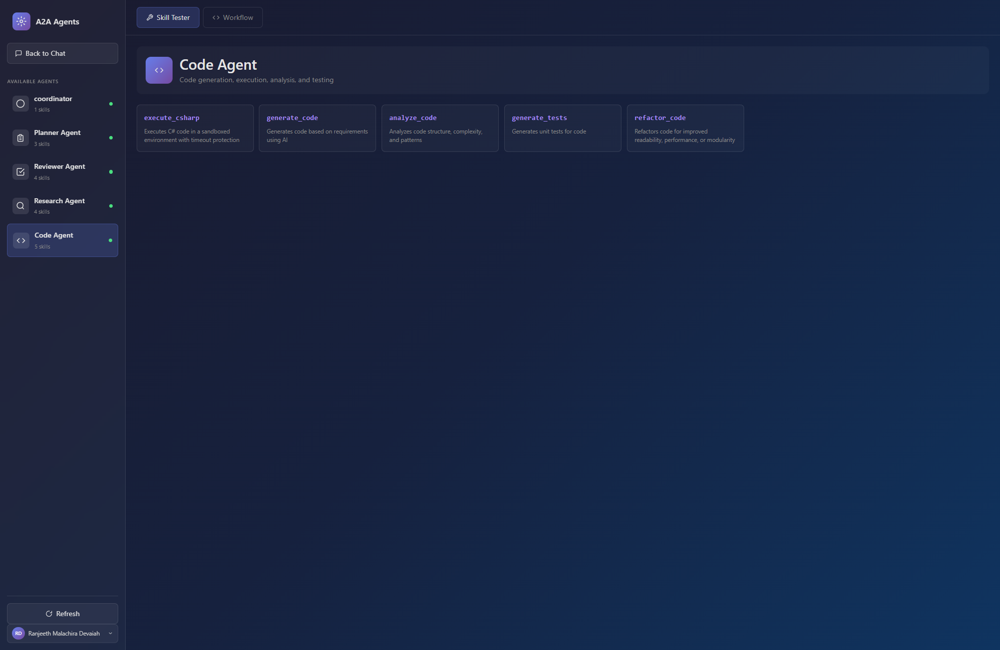
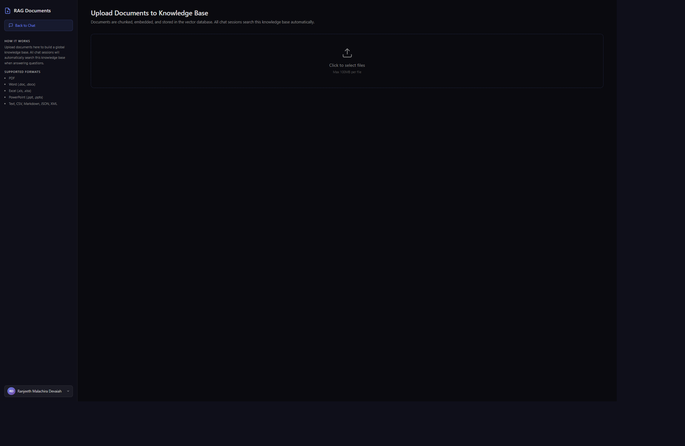
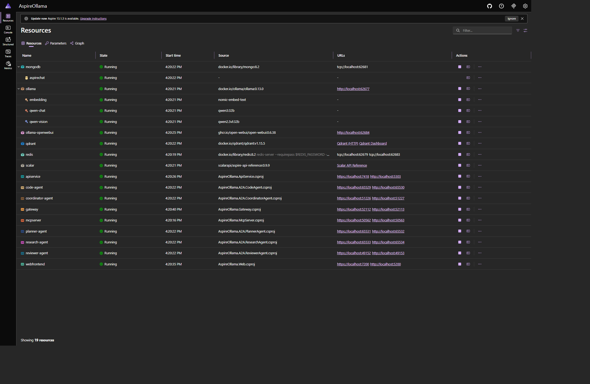
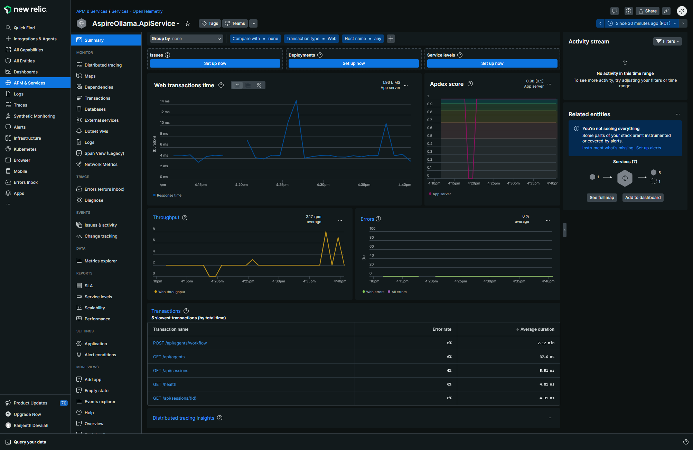

# AspireOllama

A modern AI chat application built with **.NET Aspire** and **Ollama**, featuring multimodal capabilities, tool calling, MCP (Model Context Protocol) integration, RAG (Retrieval-Augmented Generation), and persistent chat history.

## Features

- **Modern Agentic UI** - Dark-themed interface with bot avatars, animated thinking indicators, and smooth transitions
- **Dual-Model AI** - Qwen3 (32B) for text chat + tool calling, Qwen2.5-VL (32B) for vision — unified persona
- **Smart Tool Routing** - Qwen3 decides when to search documents (RAG), analyze images (vision), calculate, or search the web via tool calling
- **Web Search** - SerpAPI integration for real-time Google search results when the LLM needs current information
- **Image Analysis with Follow-ups** - Upload images and ask follow-up questions; the system retrieves images from session history
- **MCP Integration** - Connect to external MCP servers for extensible tool support
- **A2A Protocol** - Agent-to-Agent communication with standardized discovery, task management, and peer-to-peer messaging
- **Coordinator Agent** - Orchestrates multi-agent workflows with parallel execution, conflict resolution, and result aggregation
- **Multi-Agent System** - Specialized AI agents (Planner, Reviewer, Research, Code, Coordinator) that collaborate on complex tasks
- **RAG Knowledge Base** - Upload large documents (up to 100MB) to a global vector store; all chat sessions search it automatically
- **Vector Search (Qdrant)** - Document chunks embedded via nomic-embed-text, stored in Qdrant with dot product similarity
- **Document Analysis** - Upload and analyze PDF, Word, Excel, PowerPoint, and text files
- **Persistent Chat History** - MongoDB-backed session storage with full conversation history
- **Session Management** - Create, switch, and delete chat sessions with visual status indicators
- **Multi-File Upload** - Support for images and documents in chat (max 10 files, 20MB each)
- **Admin Document Upload** - Dedicated `/documents` page for admins to upload large files to the RAG knowledge base (100MB, role-protected)
- **User Profile & Sign-out** - User avatar with name, email, and sign-out in sidebar across all pages
- **Local LLM Inference** - Runs entirely on your machine using Ollama with GPU acceleration
- **Cloud-Native Architecture** - Built on .NET Aspire with automatic service discovery and health checks
- **Redis Token Cache** - Distributed MSAL token cache replacing in-memory storage for scalability
- **New Relic Observability** - Traces, metrics, and logs via OpenTelemetry OTLP with per-service naming
- **Kubernetes Ready** - Full K8s manifests with Kustomize, nginx Ingress, and multi-stage Dockerfile
- **Open WebUI** - Includes Ollama's Open WebUI for direct model interaction

## Screenshots

### Chat Interface — Markdown Rendering, Web Search & Tool Calling
.png>)
*AI assistant with markdown-rendered responses, web search results, session history sidebar, and dark theme*

### A2A Agents — Skills & Workflow

*Agent browser showing Coordinator, Planner, Reviewer, Research, and Code agents with their skills*

### RAG Document Upload

*Admin document upload page for the RAG knowledge base (100MB max, role-protected)*

### Aspire Dashboard — Service Orchestration

*All services running: MongoDB, Qdrant, Redis, Ollama, Gateway, API, Web, MCP, and 5 A2A agents*

### New Relic — Observability

*OpenTelemetry traces, metrics, and Apdex score for AspireOllama.ApiService in New Relic*

## UI Features

- **Dark Theme** - Modern dark gradient background with purple/blue accents
- **Agent Branding** - Bot icon avatars and "AI Agent" branding throughout
- **Animated States** - Pulsing status indicator, spinning loader, and fade-in message animations
- **Tool Call Display** - Visual feedback showing tool executions and results
- **Welcome Screen** - Capability highlights when starting a new conversation
- **Glass Morphism** - Frosted glass effects on sidebar and input areas
- **Responsive Design** - Sidebar with session history and full-width chat area

## Architecture

```
AspireOllama/
├── AspireOllama.AppHost/         # .NET Aspire orchestrator (MongoDB, Qdrant, Redis, Ollama, YARP, New Relic)
├── AspireOllama.ApiService/      # Backend API: chat, RAG, tools, A2A coordination
├── AspireOllama.McpServer/       # MCP server with sample tools
├── AspireOllama.Web/             # Blazor Server frontend (Redis token cache, document upload)
├── AspireOllama.Shared/          # Shared DTOs + OllamaModels constants
├── AspireOllama.ServiceDefaults/ # Common service config, auth, OpenTelemetry
├── AspireOllama.Gateway/         # YARP reverse proxy + Let's Encrypt
├── A2A/                          # Agent-to-Agent protocol agents
│   ├── AspireOllama.A2A.Shared/          # Shared A2A models and client
│   ├── AspireOllama.A2A.CoordinatorAgent/  # Multi-agent workflow orchestrator
│   ├── AspireOllama.A2A.PlannerAgent/      # Task planning and orchestration
│   ├── AspireOllama.A2A.ReviewerAgent/     # Quality review and validation
│   ├── AspireOllama.A2A.ResearchAgent/     # Knowledge gathering and context
│   └── AspireOllama.A2A.CodeAgent/         # Code generation and execution
├── k8s/                          # Kubernetes deployment manifests
│   ├── base/                     # Kustomize base (all resources)
│   ├── build-images.sh           # Docker image build script
│   └── deploy.sh                 # K8s deployment script
├── infra/terraform/              # Terraform for Azure AD setup
└── Dockerfile                    # Multi-stage build for all .NET services
```

| Project | Description |
|---------|-------------|
| `AspireOllama.AppHost` | .NET Aspire orchestrator - manages MongoDB, Qdrant, Redis, Ollama, MCP Server, API, A2A Agents, Web, YARP Gateway, and New Relic OTLP |
| `AspireOllama.ApiService` | Backend API with chat endpoints, tool calling, MCP client, RAG ingestion/retrieval, and MongoDB persistence |
| `AspireOllama.McpServer` | HTTP-based MCP server exposing weather, time, and conversion tools |
| `AspireOllama.Web` | Blazor Server frontend with agentic dark-themed UI, file upload, and Redis-backed token cache |
| `AspireOllama.Shared` | Shared DTOs, OllamaModels constants, API communication models |
| `AspireOllama.ServiceDefaults` | Common service config, auth (OIDC/OBO/JWT), OpenTelemetry with resource attributes, health checks |
| `A2A/AspireOllama.A2A.Shared` | Shared A2A protocol models, agent client, and server base class |
| `A2A/AspireOllama.A2A.CoordinatorAgent` | Multi-agent workflow orchestrator with parallel execution and conflict resolution |
| `A2A/AspireOllama.A2A.PlannerAgent` | AI-powered task planning and complexity assessment |
| `A2A/AspireOllama.A2A.ReviewerAgent` | Quality assurance agent for reviewing responses and code |
| `A2A/AspireOllama.A2A.ResearchAgent` | Knowledge gathering and context synthesis agent |
| `A2A/AspireOllama.A2A.CodeAgent` | Code generation, execution, analysis, and testing agent |

For detailed architecture documentation, see [ARCHITECTURE.md](ARCHITECTURE.md).

## Tech Stack

- **.NET 10** / **C# 13**
- **.NET Aspire 13** - Cloud-native orchestration
- **Ollama** - Local LLM inference
- **Qwen3 (32B)** - Primary chat model with tool calling (RAG search, image analysis delegation)
- **Qwen2.5-VL (32B)** - Vision model for image analysis (called via tool by Qwen3)
- **Model Context Protocol (MCP)** - Extensible tool integration
- **Blazor Server** - Interactive web UI (prerender disabled for clean loading)
- **MongoDB** - Chat session and message persistence (replaced SQLite)
- **Qdrant** - Vector database for RAG with dot product similarity
- **nomic-embed-text** - Embedding model for document chunking and query (via Ollama)
- **Redis** - Distributed MSAL token cache (via Aspire)
- **Microsoft.Identity.Web** - Azure AD authentication (OIDC, OBO, distributed token cache)
- **OpenTelemetry** - Traces, metrics, and logs exported to New Relic via OTLP
- **Microsoft.Extensions.AI** - Unified AI abstractions
- **FastEndpoints** - Structured API routing
- **CommunityToolkit.Aspire.OllamaSharp** - Ollama integration for Aspire
- **DocumentFormat.OpenXml** - Word, Excel, PowerPoint processing
- **PdfPig** - PDF text extraction
- **Markdig** - Markdown to HTML rendering (workflow Final Result)
- **SerpAPI** - Google web search integration (100 free searches/month)

## Getting Started

### Prerequisites

- [.NET 10 SDK](https://dotnet.microsoft.com/download/dotnet/10.0)
- [Docker Desktop](https://www.docker.com/products/docker-desktop/)
- GPU recommended for faster inference

### Run the Application

```bash
dotnet run --project AspireOllama.AppHost
```

The first run will download Qwen3 (32B), Qwen2.5-VL (32B), and nomic-embed-text models. This may take several minutes depending on your internet connection. Model names are configured centrally in `AspireOllama.Shared/OllamaModels.cs`.

### Access Points

Once running, the Aspire Dashboard will show all service endpoints:

- **Aspire Dashboard** - Service management, logs, and traces
- **Web Frontend** - Main chat interface
- **API Service** - Backend REST API with Scalar docs at `/scalar/v1`
- **MCP Server** - External tool server
- **Open WebUI** - Direct Ollama interaction

## Tool Calling

Qwen3 supports tool calling natively. The AI decides when to use tools based on the user's question.

### Built-in Tools

| Tool | Description | Enabled by Default |
|------|-------------|-------------------|
| Calculator | Evaluate mathematical expressions | Yes |
| Web Search | Search the web (requires API key) | No |
| Code Execution | Run Python/JavaScript/C# code | No |
| File Operations | List/read/write files in sandbox | No |

### MCP Server Tools

The external MCP server provides additional tools:

| Tool | Description |
|------|-------------|
| `get_weather` | Get weather for a city (demo data) |
| `get_time` | Get current time in a timezone |
| `convert_units` | Convert between units (km/miles, kg/lbs, celsius/fahrenheit) |

### Example Queries

- "What is 15 * 7 + 23?" → Uses built-in calculator tool
- "What's the weather in London?" → Uses MCP get_weather tool
- "What time is it in Tokyo?" → Uses MCP get_time tool
- "Convert 100 km to miles" → Uses MCP convert_units tool

## A2A Agents

AspireOllama includes specialized AI agents that communicate via the [Agent-to-Agent (A2A) Protocol](https://github.com/google/a2a-protocol). Each agent exposes standardized endpoints for discovery and task management.

### Agent Capabilities

| Agent | Description | Skills |
|-------|-------------|--------|
| **Coordinator** | Orchestrates multi-agent workflows with AI-driven planning, parallel execution, conflict resolution, and aggregation. Knows all 17 skills across 4 agents (Planner: 3, Research: 4, Code: 5, Reviewer: 4). | orchestrate_task |
| **Planner** | Task planning and complexity assessment | create_plan, assess_complexity, suggest_agents |
| **Reviewer** | Quality assurance and validation | review_response, review_code, review_plan, provide_feedback |
| **Research** | Knowledge gathering and context synthesis | search_knowledge, get_topic_details, gather_context, suggest_topics |
| **Code** | Code generation, execution, and analysis | execute_csharp, generate_code, analyze_code, generate_tests, refactor_code |

### A2A Endpoints

Each agent exposes the full A2A protocol (unsupported operations return 501):

| Endpoint | Description | Auth |
|----------|-------------|------|
| `GET /.well-known/agent.json` | Agent Card — discovery | None |
| `POST /a2a/message:send` | Send a message, receive a task | Role + Rate limited |
| `POST /a2a/message:stream` | Send a message, stream updates | Role + Rate limited |
| `GET /a2a/tasks/{taskId}` | Get task status and results | Role + Rate limited |
| `GET /a2a/tasks` | List all tasks | Role + Rate limited |
| `POST /a2a/tasks/{taskId}:cancel` | Cancel a running task | Role + Rate limited |
| `POST /a2a/tasks/{taskId}:subscribe` | Subscribe to task events | Role + Rate limited |
| `POST /a2a/tasks/{taskId}/pushNotification` | Create push notification config | Role + Rate limited |
| `GET /a2a/tasks/{taskId}/pushNotification` | List push notification configs | Role + Rate limited |
| `DELETE /a2a/tasks/{taskId}/pushNotification/{id}` | Delete push notification config | Role + Rate limited |
| `GET /a2a/agent/card` | Extended agent card (authenticated) | Role + Rate limited |

### Rate Limiting

Per-user rate limiting on all A2A endpoints (20 req/min, 429 when exceeded). Partitioned by `oid` JWT claim.

### Inter-Agent Communication

Agents can discover and call each other directly:
- **Coordinator** calls all agents via AI-driven planning
- **Planner** calls Research for context and Reviewer for validation
- **Code** calls Reviewer for code review feedback
- All agents use Aspire service discovery for URL resolution

For detailed A2A documentation, see [A2A/README.md](A2A/README.md).

### Tool Configuration

Configure built-in tools in `appsettings.json`:

```json
{
  "Tools": {
    "EnableCalculator": true,
    "EnableWebSearch": false,
    "EnableCodeExecution": false,
    "EnableFileOperations": false,
    "SandboxPath": "./sandbox"
  }
}
```

## API Endpoints

| Method | Endpoint | Description | Role Required |
|--------|----------|-------------|---------------|
| `POST` | `/api/chat` | Send a message with optional images (RAG context injected automatically) | `Api.Chat.Write` |
| `POST` | `/api/sessions` | Create a new chat session | `Api.Sessions.Manage` |
| `GET` | `/api/sessions` | List all chat sessions | `Api.Chat.Read` |
| `GET` | `/api/sessions/{id}` | Get session with message history | `Api.Chat.Read` |
| `DELETE` | `/api/sessions/{id}` | Delete a chat session | `Api.Sessions.Manage` |
| `POST` | `/api/documents/upload` | Upload documents to RAG knowledge base | `Api.Admin` or `Api.Documents.Manage` |
| `GET` | `/api/me` | Get current user's profile and roles from access token | Any API role |
| `GET` | `/api/agents` | List available A2A agents | `Api.Chat.Read` |
| `POST` | `/api/agents/call` | Call an A2A agent skill | `Api.Chat.Write` |
| `POST` | `/api/agents/workflow` | Run a multi-agent workflow | `Api.Chat.Write` |

## Supported File Formats

**Images (processed by Qwen2.5-VL via analyze_image tool):**
- JPEG (.jpg, .jpeg)
- PNG (.png)
- GIF (.gif)
- WebP (.webp)

**Documents (text extracted for context):**
- PDF (.pdf)
- Microsoft Word (.doc, .docx)
- Microsoft Excel (.xls, .xlsx)
- Microsoft PowerPoint (.ppt, .pptx)
- Text files (.txt, .csv, .md, .json, .xml, .log)

### Limits

**Chat file attachments:**
- Maximum 10 files per message, 20MB each
- Images analyzed by Qwen2.5-VL via tool call, documents extracted inline

**RAG document uploads (`/documents` page):**
- Maximum 100MB per file
- Documents are chunked, embedded (nomic-embed-text), and stored in Qdrant
- All chat sessions automatically search the RAG knowledge base
- Requires `Api.Admin` or `Api.Documents.Manage` role

## Redis Token Cache

MSAL token caching uses Redis instead of in-memory storage. This ensures tokens survive restarts and scale across multiple instances.

- **AppHost** deploys Redis via `builder.AddRedis("redis")`
- **Web Frontend** registers `AddRedisDistributedCache("redis")` and uses `.AddDistributedTokenCaches()` instead of `.AddInMemoryTokenCaches()`
- Tokens (user + app) are persisted in Redis automatically by Microsoft.Identity.Web

No configuration needed — Aspire wires the connection string automatically.

## RAG (Retrieval-Augmented Generation)

Documents uploaded via the `/documents` page form a **global knowledge base**. All chat sessions automatically search this knowledge base when answering questions.

### Architecture

```
Admin uploads document via /documents page
  → multipart/form-data POST to /upload-documents (Web server)
    → IDownstreamApi (OBO) → POST /api/documents/upload (API service)
      → Extract text (PDF, Word, Excel, PowerPoint, Text)
      → Chunk text (512 chars, 64 char overlap, sentence-boundary splitting)
      → Embed chunks (nomic-embed-text via Ollama)
      → Store vectors in Qdrant (dot product distance)

User asks a question in any chat session
  → AiChatService embeds the query
  → Qdrant dot product search across ALL documents (top 5 chunks)
  → Relevant chunks injected as [RELEVANT CONTEXT] in the LLM prompt
  → LLM answers using the retrieved context
```

### Infrastructure

| Component | Purpose |
|-----------|---------|
| **Qdrant** | Vector database storing document chunk embeddings (dot product) |
| **nomic-embed-text** | Ollama embedding model for chunking and query embedding |
| **MongoDB** | Chat sessions and messages (not used for RAG) |

### Authorization

- **Upload**: Requires `Api.Admin` or `Api.Documents.Manage` role (checked on the access token by the API)
- **Search**: All authenticated users — RAG context is injected automatically during chat
- **UI visibility**: Documents button and page access controlled by `UserRoleService` which calls `GET /api/me` to read roles from the access token

## Dual-Model Architecture

The system uses two LLMs behind a single unified persona — the user sees one AI assistant.

### Model Routing

| Request type | Model used | How |
|-------------|-----------|-----|
| Text chat | Qwen3 (32B) | Direct chat, tool calling available |
| "What does the document say about X?" | Qwen3 → `search_knowledge_base` tool | Qwen3 decides to search RAG via Qdrant |
| Image upload ("describe this") | Qwen3 → `analyze_image` tool → Qwen2.5-VL | Qwen3 delegates to vision model |
| Follow-up about image ("what color is the logo?") | Qwen3 → `analyze_image` tool → Qwen2.5-VL | Tool retrieves image from MongoDB session history |
| Document upload via chat (PDF/Word) | Qwen3 (text extracted inline) | No RAG search — file content injected directly |
| Current events, news, "search the web" | Qwen3 → `web_search` tool | SerpAPI → Google results |
| Math / calculations | Qwen3 → `calculator` tool | DataTable.Compute evaluation |
| General chat / greetings | Qwen3 (no tools) | Direct response |

### Tools Registered on Qwen3

| Tool | Parameters | When Qwen3 calls it |
|------|-----------|---------------------|
| `calculator` | `session_id`, `expression` | Math and arithmetic |
| `search_knowledge_base` | `session_id`, `query`, `top_k` | Uploaded document questions. Returns results with relevance scores (>0.5 threshold). |
| `analyze_image` | `session_id`, `instruction` | Image uploads and follow-up questions. Retrieves from request or session history. |
| `web_search` | `session_id`, `query`, `max_results` | Current events, news, anything after LLM knowledge cutoff. Uses SerpAPI (Google). |

### Model Configuration

All model names are centralized in `AspireOllama.Shared/OllamaModels.cs`:

```csharp
public static class OllamaModels
{
    public const string ChatModel = "qwen3:32b";        // Change to switch chat model
    public const string VisionModel = "qwen2.5vl:32b";  // Change to switch vision model
    public const string EmbeddingModel = "nomic-embed-text";
}
```

One file change switches models across all services, agents, and the AppHost.

## Coordinator Agent

The Coordinator Agent orchestrates complex multi-agent workflows. The API service delegates workflow requests to the Coordinator with a single A2A call.

### Execution Phases

| Phase | What happens | Agent |
|-------|-------------|-------|
| 1. Assess | Evaluate task complexity | Planner |
| 2. Plan | Create step-by-step execution plan | Planner |
| 3. Execute | Run subtasks in parallel where possible | Research + Code |
| 4. Review | Check for conflicts, validate results | Reviewer |
| 5. Aggregate | Synthesize all results via LLM | Coordinator (local) |

### Features
- **Parallel execution** of independent subtasks via `Task.WhenAll`
- **Conflict resolution** — reviewer detects contradictions, conflicting agents re-run with feedback
- **Retry with backoff** — max 2 retries per subtask, exponential backoff, 5-minute timeout
- **Result aggregation** — LLM synthesizes all agent outputs into a coherent response
- **Full artifact tracking** — each phase stored as a named artifact on the task

## User Sessions

Chat sessions are scoped by `userId` in MongoDB. Each user sees only their own sessions. The user profile (name, email, roles) is read from the access token via `GET /api/me`.

## Timeouts

Consistent 10-minute timeouts are configured across all services (Ollama HTTP client, MCP client, A2A client). The YARP gateway uses 15-minute timeouts for routes to the Coordinator and API Service to allow for multi-agent workflows.

## Heartbeat Logging

Aspire health-check heartbeat logging is suppressed in `ServiceDefaults` to reduce log noise. Only non-healthy heartbeat results are logged.

## Workflow UI

The Agents page (`Agents.razor`) provides a visual workflow experience:

- **Hub diagram** showing the flow: Coordinator plan --> Agents box --> Coordinator aggregate
- **Expandable blocks** for each workflow phase (assess, plan, execute, review, aggregate)
- **Preset buttons** for common multi-agent tasks
- **Call Summary** displayed as expandable section with per-agent stats
- **Final Result** rendered as formatted markdown (headings, code blocks, lists) with "Show all" / "Show less" toggle
- Agent skill counts shown per agent in the UI

## Observability (New Relic)

All services export traces, metrics, and logs to New Relic via OpenTelemetry OTLP.

### Configuration

In `AspireOllama.AppHost/appsettings.json`:

```json
{
  "NewRelic": {
    "LicenseKey": "",
    "OtlpEndpoint": "https://otlp.nr-data.net"
  },
  "Otel": {
    "ServiceNamespace": "AspireOllama",
    "ServiceVersion": "1.0.0",
    "DeploymentEnvironment": "development"
  }
}
```

Set the license key via user secrets:

```bash
cd AspireOllama.AppHost
dotnet user-secrets set "NewRelic:LicenseKey" "YOUR_KEY"
```

For EU region, set `OtlpEndpoint` to `https://otlp.eu01.nr-data.net`.

### Service Names in New Relic

| Service | OTEL Service Name |
|---------|-------------------|
| API Service | `AspireOllama.ApiService` |
| Web Frontend | `AspireOllama.Web` |
| MCP Server | `AspireOllama.McpServer` |
| YARP Gateway | `AspireOllama.Gateway` |
| Planner Agent | `AspireOllama.A2A.PlannerAgent` |
| Reviewer Agent | `AspireOllama.A2A.ReviewerAgent` |
| Research Agent | `AspireOllama.A2A.ResearchAgent` |
| Code Agent | `AspireOllama.A2A.CodeAgent` |

### Resource Attributes

Each service reports:
- `service.name` — per-service name (see table above)
- `service.namespace` — `AspireOllama`
- `service.version` — `1.0.0`
- `deployment.environment` — `development` / `production`

If the New Relic license key is empty, OTLP export is skipped — no impact on local dev.

## Kubernetes Deployment

Full K8s manifests are provided in `k8s/base/` using Kustomize.

### Architecture

In K8s, the Aspire YARP gateway is replaced by an **nginx Ingress** with the same routing rules:

| Path | Backend |
|------|---------|
| `/api/*` | apiservice |
| `/mcp/*` | mcpserver |
| `/a2a/planner/*` | planner-agent |
| `/a2a/reviewer/*` | reviewer-agent |
| `/a2a/research/*` | research-agent |
| `/a2a/code/*` | code-agent |
| `/*` (default) | webfrontend |

### Prerequisites

- Kubernetes cluster with nginx Ingress controller
- Container registry (e.g., ACR, Docker Hub)
- GPU node for Ollama (nvidia.com/gpu resource)

### Deploy

```bash
# 1. Edit k8s/base/secrets.yaml with real Azure AD and New Relic values
# 2. Edit k8s/base/ingress.yaml with your domain
# 3. Build and push Docker images
./k8s/build-images.sh myregistry.azurecr.io v1.0.0

# 4. Deploy to cluster
./k8s/deploy.sh myregistry.azurecr.io v1.0.0

# 5. Verify
kubectl get pods -n aspireollama
kubectl get ingress -n aspireollama
```

### K8s Resources

| Resource | Description |
|----------|-------------|
| `namespace.yaml` | `aspireollama` namespace |
| `configmap.yaml` | OTEL config, Azure AD common, service discovery, downstream APIs |
| `secrets.yaml` | Azure AD credentials (web + backend), New Relic license key |
| `redis.yaml` | Redis deployment + PVC for token cache |
| `ollama.yaml` | Ollama deployment + GPU + PVC + model-pull Job |
| `apiservice.yaml` | Chat API deployment + service |
| `mcpserver.yaml` | MCP tools server deployment + service |
| `webfrontend.yaml` | Blazor frontend deployment + service |
| `planner-agent.yaml` | A2A Planner deployment + service |
| `reviewer-agent.yaml` | A2A Reviewer deployment + service |
| `research-agent.yaml` | A2A Research deployment + service |
| `code-agent.yaml` | A2A Code deployment + service |
| `ingress.yaml` | nginx Ingress (replaces YARP gateway) |

### Docker Build

A single multi-stage `Dockerfile` at the repo root builds any .NET service:

```bash
docker build --build-arg PROJECT=AspireOllama.Web -t aspireollama-web .
docker build --build-arg PROJECT=AspireOllama.ApiService -t aspireollama-apiservice .
```

## Development

### Building

```bash
dotnet build
```

### Database

- **MongoDB** stores chat sessions and messages (deployed automatically by Aspire)
- **Qdrant** stores document chunk vectors for RAG (deployed automatically by Aspire)
- Both use data volumes for persistence across restarts

### Project Structure

```
AspireOllama.ApiService/
├── Program.cs
├── Data/
│   ├── MongoDocuments.cs         # MongoDB document models (sessions, messages)
│   ├── MongoCollections.cs       # Typed collection accessor
│   └── MongoIndexInitializer.cs  # Creates indexes on startup
├── Endpoints/
│   ├── ChatEndpoint.cs           # Chat with RAG context injection
│   ├── DocumentUploadEndpoint.cs # Upload documents to RAG (admin only)
│   ├── MeEndpoint.cs             # User profile + roles from access token
│   ├── CreateSessionEndpoint.cs
│   ├── GetSessionsEndpoint.cs
│   ├── GetSessionEndpoint.cs
│   ├── DeleteSessionEndpoint.cs
│   ├── AgentsEndpoint.cs
│   ├── TestOllamaEndpoint.cs
│   └── McpDebugEndpoint.cs
└── Services/
    ├── AI/
    │   ├── IAiChatService.cs
    │   ├── AiChatService.cs      # Builds context with RAG retrieval
    │   └── AiChatResult.cs
    ├── Session/
    │   ├── ISessionService.cs
    │   └── SessionService.cs     # MongoDB-backed
    ├── Message/
    │   ├── IChatMessageService.cs
    │   └── ChatMessageService.cs # MongoDB-backed
    ├── Document/
    │   ├── IDocumentProcessingService.cs
    │   ├── DocumentProcessingService.cs
    │   ├── ITextChunkingService.cs
    │   ├── TextChunkingService.cs       # Sliding window chunker
    │   ├── IDocumentIngestionService.cs
    │   └── DocumentIngestionService.cs  # Extract → chunk → embed → Qdrant
    ├── Embedding/
    │   ├── IEmbeddingService.cs
    │   └── OllamaEmbeddingService.cs   # nomic-embed-text via Ollama
    ├── Rag/
    │   ├── IRagRetrievalService.cs
    │   └── RagRetrievalService.cs      # Qdrant dot product search
    ├── Tools/
    │   ├── ITool.cs
    │   ├── IToolRegistry.cs
    │   ├── ToolRegistry.cs
    │   ├── CalculatorTool.cs
    │   ├── WebSearchTool.cs
    │   ├── CodeExecutionTool.cs
    │   └── FileOperationsTool.cs
    └── Mcp/
        ├── IMcpService.cs
        └── McpService.cs

AspireOllama.McpServer/
└── Program.cs                    # MCP tools: get_weather, get_time, convert_units

AspireOllama.Web/
├── Program.cs                    # Includes /upload-documents multipart endpoint
├── ChatApiClient.cs
├── UserRoleService.cs            # Caches user roles from access token
└── Components/
    ├── Pages/
    │   ├── Chat.razor            # Main chat UI
    │   ├── Agents.razor          # A2A agents UI
    │   └── Documents.razor       # RAG document upload (admin)
    └── Shared/
        └── UserProfileMenu.razor # User avatar + sign-out component

AspireOllama.Shared/
├── OllamaModels.cs               # Central model name constants (change models here)
├── ChatSession.cs
├── ChatSessionDetails.cs
├── ChatHistoryMessage.cs
├── ChatMessageRequest.cs
├── ChatMessageResponse.cs
├── DocumentUploadRequest.cs      # RAG upload request/response models
├── UserInfo.cs                   # User profile + roles DTO
├── ImageAttachment.cs
├── FileAttachment.cs
├── ToolCall.cs
└── ToolConfiguration.cs

A2A/AspireOllama.A2A.CoordinatorAgent/
├── Program.cs                    # Service setup, agent discovery (all 4 leaf agents)
└── CoordinatorA2AServer.cs       # 5-phase orchestration engine

AspireOllama.AppHost/
├── AppHost.cs                    # Aspire orchestration (MongoDB, Qdrant, Redis, Ollama, YARP, New Relic)
└── appsettings.json              # New Relic + OTEL configuration
```

## Troubleshooting

### Timeout Errors

If you encounter timeout errors when uploading images:
- The Qwen2.5-VL model requires significant processing time for images
- HTTP timeouts are set to 10 minutes
- Ensure Ollama has finished loading the model (check Aspire Dashboard logs)

### 500 Errors from Ollama

- Verify the Qwen3 and Qwen2.5-VL models are fully downloaded
- Check Ollama container logs in the Aspire Dashboard
- Test basic chat functionality at `/test-ollama`

### MCP Connection Issues

- Check `/debug/mcp` endpoint for connection status
- Verify MCP server is running in Aspire Dashboard
- Check for retry attempts in API service logs
- Ensure `app.MapMcp("/mcp")` is present in MCP server's Program.cs

### A2A Agent Connection Issues

- Verify agents are running in Aspire Dashboard
- Check that `AddOlamaSharpClient(OllamaModels.ChatModel)` is called in each agent's Program.cs
- Agents read Ollama connection from `ConnectionStrings:ollama` (injected by Aspire)
- Check agent logs for "Failed to connect" errors

### Tool Calls Not Working

- Ensure you're asking questions that require tools
- Qwen3 handles tool calling (RAG search, image analysis delegation)
- Qwen2.5-VL handles vision only (no tool calling support)
- Model names are centralized in `AspireOllama.Shared/OllamaModels.cs`

### Build Errors (File Locked)

Stop the running application before rebuilding:
- Press `Ctrl+C` in the terminal running the app
- Then run `dotnet build` or `dotnet run`

## License

All rights reserved. This software is proprietary and confidential. No part of this software may be reproduced, distributed, or transmitted in any form without prior written permission from the author.
